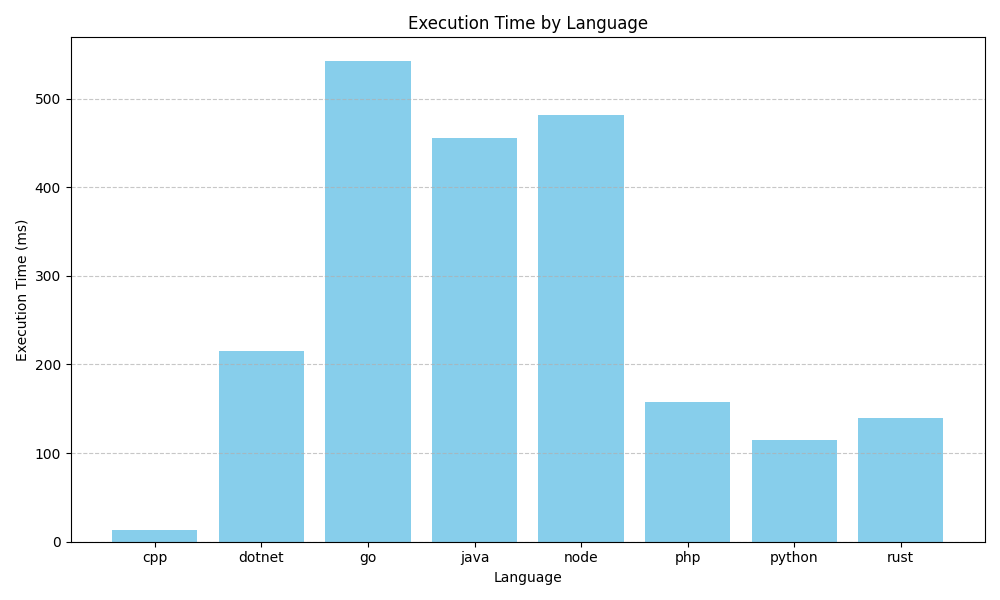

# SQLite 사용자 정의 함수(UDF) 예제 모음

이 저장소는 다양한 프로그래밍 언어(C++, C#, Go, Java, Node.js, PHP, Python, Rust)로 SQLite 사용자 정의 함수(User Defined Function, UDF)를 구현하는 방법을 예시로 제공합니다. 각 언어별로 SQLite와 연동하여 UDF를 등록하고 사용하는 샘플 코드와 빌드/실행 스크립트가 포함되어 있습니다.

## 폴더 구조

```
.
├── cpp/      # C++ 예제
├── dotnet/   # C# (.NET) 예제
├── go/       # Go 예제
├── java/     # Java 예제
├── node/     # Node.js 예제
├── php/      # PHP 예제
├── python/   # Python 예제
├── rust/     # Rust 예제
```

각 폴더에는 다음과 같은 파일이 포함되어 있습니다:
- `sample.*` : 각 언어별 UDF 샘플 코드
- `build.sh` : 빌드 스크립트 (필요한 경우)
- `run.sh`   : 실행 스크립트

## 공통 실행 방법

1. 각 언어별 폴더로 이동합니다.
2. 필요시 `build.sh`를 실행하여 빌드합니다.
3. `run.sh`를 실행하여 샘플을 확인합니다.

예시 (C++):
```sh
cd cpp
./build.sh
./run.sh
```

## 참고

- 각 언어별로 SQLite UDF 등록 방식이 다르므로, 각 폴더의 `readme.md` 또는 주석을 참고하세요.
- 빌드 및 실행 환경에 따라 추가 패키지 설치가 필요할 수 있습니다.

## 참고 자료

- SQLite 사용자 정의 함수(UDF) 공식 문서: [https://www.sqlite.org/appfunc.html](https://www.sqlite.org/appfunc.html)

## 성능 비교 결과

아래 이미지는 각 언어별로 SQLite UDF를 100,000번씩 실행한 결과의 실행 시간(ms)입니다.



## 언어 설치 안내

각 언어의 실행 환경(컴파일러, 인터프리터 등)은 직접 공식 홈페이지나 패키지 매니저를 참고하여 설치해 주세요. (예: Python, Node.js, Java, Go, Rust, PHP, .NET 등)

※ 언어 및 개발 환경의 설치 방법은 사용하는 운영체제(OS)마다 다를 수 있으니, 각 OS에 맞는 설치 방법을 참고하시기 바랍니다.
